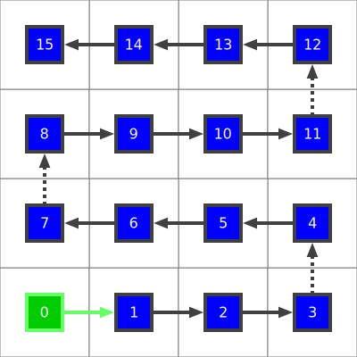

<!---
This file was automatically generated by a docs-generator scripts.
Do not edit this file directly.
It used the template: "/Users/e0654864/devel/matrix-scan/docs-generators/templates/README.handlebars.md"
-->

```
martix             0️⃣1️⃣2️⃣
                   5️⃣4️⃣3️⃣
                   6️⃣7️⃣8️⃣

scan               0️⃣1️⃣2️⃣3️⃣4️⃣5️⃣6️⃣7️⃣8️⃣

happiness          🎉  🪄
```

# 🔢 Introduction

This library is for mapping between two dimensional matrices and one dimensional arrays.
The concept is each element of the 2D matrix is ***"scanned"*** in a well defined order
to map it to the 1D array. In the other direction a ***"layout"*** maps a 1D array to
a 2D matrix.

# The Concept

To explain the concept, imagine a strip of lights laid out in rows to create grid.

Each light is an **element**.
```
 💡           0️⃣
```

The strip of lights is a 1D **array**
```
💡💡💡💡    0️⃣1️⃣2️⃣3️⃣
```

The grid of lights is a ***matrix***.
```
  💡💡        0️⃣1️⃣
  💡💡        2️⃣3️⃣
```


## 📖 Definitions

We use the following definitions:

 - ***matrix*** - an arrangement of elements in a 2D space. Every element has an `x,y` coordinate in the matrix.
 - ***array*** - an arrangement of elements in a 1D space. Every element has an `n` position in the array.
 - ***element*** - represents anything that can be usefully arranged in arrays and matrices.
 - ***scan*** -  mapping elements from a **matrix to an array** - "a scan across a matrix".
 - ***layout*** - mapping elements from an **array to a matrix** - "laying out an array into a matrix"


## 🔢 Supported layouts

The layouts this library supports can be found [here](docs/generated/layouts/layouts.md). Here's an example:

- starting: **BottomLeft** (see green box)
- direction: **X** (see green arrow)
- pattern: **zigzag** (see dotted line arrows)




## 💻 Getting started

Install as a dependency
```bash
nom init -y .
npm install matrix-scan
```

### CommonJS 
Using old style CommonJS (CJS) `require()`

```js
var ms = require('matrix-scan')
var Matrix = ms.Matrix
var m = new Matrix({height:3, width:3})
```

### ESM Import
Using new style ECMAScript module (ESM) import, supported since  Node.js 13.2.0

```js
import { Matrix } from 'matrix-scan'
var m = new Matrix({height:3, width:3})
```

### TypeScript Import
Same syntax as ESM but TypeScript allows strong typed variables, useful for static code validation and autocompletion in editors like atom and VSCode.

```js
import { Matrix } from 'matrix-scan'
// Trivial example of an explicit type annotation
var m: Matrix
m = new Matrix({height:3, width:3})
```

### Basic properties
Here are the basic properties and their possible values

```js

// In the constuctor (all optional)
var m = new Matrix({
  height:3,
  width:3,
  startCorner: Matrix.Corner.BottomLeft,
  direction: Matrix.Direction.X,
  pattern: Matrix.Pattern.zigzag
})

// startCorner can be:
Matrix.Corner.BottomLeft
Matrix.Corner.BottomRight
Matrix.Corner.TopLeft
Matrix.Corner.TopRight

//direction can be:
Matrix.Direction.Y
Matrix.Direction.Y

//pattern can be:
Matrix.Pattern.loop
Matrix.Pattern.zigzag

// And they can be get set after constuction too
m.height = 4
m.width = 5
m.startCorner =  Matrix.Corner.TopLeft
m.direction =  Matrix.Direction.Y
m.pattern =  Matrix.Pattern.loop
```

### Caculated properties
These properties can also be get and/or set on a Matrix object, but they are calculated (on get) or have side effects (on set).

```js

// Read only. Will alows be m.height * m.width
m.fullArrayLength

// Read write. This is the length of each continuous run of values across the
// matrix. It will either be m.height or m.width debding on m.direction
m.subArrayLength

// Read write. This is the number of sub arrays needed to cover the
// matrix. It will either be m.height or m.width debding on m.direction
m.subArrayCount
```

### Booleam tests
These give simple true/false information about the direction of the matrix. They can be understood by where the first and last element of the matrix. is.

```js

//First element of the matrix is..
 m.isTopStart()    // ..on the top row (last could be left, right or bottom)
 m.isBottomStart() // ..on the bottom row (last could be left, right or top)
 m.isLeftStart()   // ..on the left row (last could be right, top or bottom)
 m.isRightStart()  // ..on the right row (last could be left, top or bottom)

 m.isTopDown()     // ..on the top row, last is on the bottom
 m.isBottomUp()    // ..on the bottom row, last is on the top
 m.isLeftRight()   // ..on the left column, last is on the right
 m.isRightLeft()   // ..on the right column, last is on the left
```


## 🗂 Documentation

* [Layouts](docs/generated/layouts/layouts.md)
* [API](docs/generated/api/matrix-scan.md)

## 🌎 Real world uses

**A bitmap image**. Pixels (elements) of the image are drawn in 2D space (matrix) but are stored in a sequential order (array) in a file.

**A LED array**. LED arrays made of [addressable led strips](https://www.google.com/search?q=addressable%20led%20strip). In this case the LEDs (elements) are on a PCB strip (array) that is laid out in a repeating pattern (matrix) to create an LED array.

**A coverage path**. Robotic pool cleaners, vacuum cleaners and lawn movers all need to cover a 2D space (matrix) but move in lines (arrays). Most seem to do this by moving in random lines but maybe they could be programmed more efficiently. Police on the ground, or aircraft in the sky, will often adopt a zigzag search pattern (arrays) to search of an area (matrix).

**JPEG encoding**. The JPEG image format uses a scan pattern to enumerate pixels in 2D image (matrix) to a 1D representation (array) for encoring and compression. **NOTE:** This library does not support JPEG scan patters, but maybe it could one day...


## 🧍Contributors

Adam Griffiths
