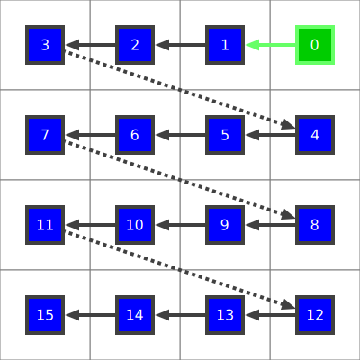

# Introduction
This page lists examples of all possible layouts using 4x4 matrix examples. (It
is an automatically generated by the `/bin/generatelayouts` command.)

# 1. zigzag pattern

## 1.1. X direction

### 1.1.1. TopLeft start corner
  - pattern: **zigzag** (see dotted line arrows)
  - direction: **X** (see green arrow)
  - starting: **TopLeft** (see green box)

### 1.1.2. TopRight start corner
  - pattern: **zigzag** (see dotted line arrows)
  - direction: **X** (see green arrow)
  - starting: **TopRight** (see green box)

### 1.1.3. BottomLeft start corner
  - pattern: **zigzag** (see dotted line arrows)
  - direction: **X** (see green arrow)
  - starting: **BottomLeft** (see green box)

### 1.1.4. BottomRight start corner
  - pattern: **zigzag** (see dotted line arrows)
  - direction: **X** (see green arrow)
  - starting: **BottomRight** (see green box)

## 1.2. Y direction

### 1.2.1. TopLeft start corner
  - pattern: **zigzag** (see dotted line arrows)
  - direction: **Y** (see green arrow)
  - starting: **TopLeft** (see green box)

### 1.2.2. TopRight start corner
  - pattern: **zigzag** (see dotted line arrows)
  - direction: **Y** (see green arrow)
  - starting: **TopRight** (see green box)

### 1.2.3. BottomLeft start corner
  - pattern: **zigzag** (see dotted line arrows)
  - direction: **Y** (see green arrow)
  - starting: **BottomLeft** (see green box)

### 1.2.4. BottomRight start corner
  - pattern: **zigzag** (see dotted line arrows)
  - direction: **Y** (see green arrow)
  - starting: **BottomRight** (see green box)

# 2. loop pattern

## 2.1. X direction

### 2.1.1. TopLeft start corner
  - pattern: **loop** (see dotted line arrows)
  - direction: **X** (see green arrow)
  - starting: **TopLeft** (see green box)

### 2.1.2. TopRight start corner
  - pattern: **loop** (see dotted line arrows)
  - direction: **X** (see green arrow)
  - starting: **TopRight** (see green box)

### 2.1.3. BottomLeft start corner
  - pattern: **loop** (see dotted line arrows)
  - direction: **X** (see green arrow)
  - starting: **BottomLeft** (see green box)

### 2.1.4. BottomRight start corner
  - pattern: **loop** (see dotted line arrows)
  - direction: **X** (see green arrow)
  - starting: **BottomRight** (see green box)

## 2.2. Y direction

### 2.2.1. TopLeft start corner
  - pattern: **loop** (see dotted line arrows)
  - direction: **Y** (see green arrow)
  - starting: **TopLeft** (see green box)

### 2.2.2. TopRight start corner
  - pattern: **loop** (see dotted line arrows)
  - direction: **Y** (see green arrow)
  - starting: **TopRight** (see green box)

### 2.2.3. BottomLeft start corner
  - pattern: **loop** (see dotted line arrows)
  - direction: **Y** (see green arrow)
  - starting: **BottomLeft** (see green box)

### 2.2.4. BottomRight start corner
  - pattern: **loop** (see dotted line arrows)
  - direction: **Y** (see green arrow)
  - starting: **BottomRight** (see green box)

